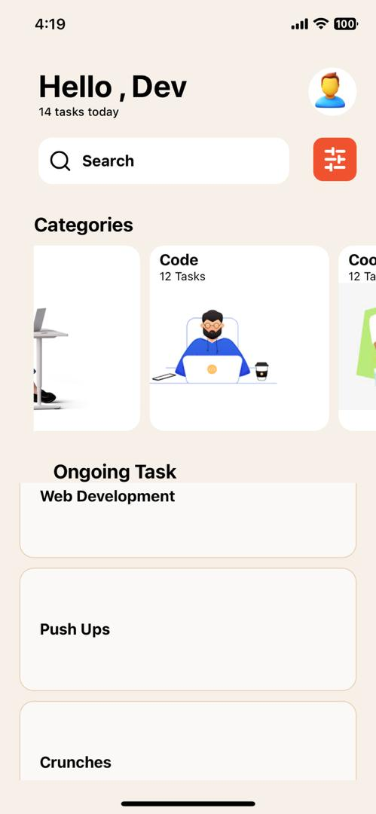

#
# 

Description Of Each Component`s usage:

TEXT: The text component is used to display text in the user interface. It can contain plain text, and can also be styled and nested with other Text components.

SCROLL VIEW: The ScrollView component provides a scrollable container that can hold multiple components and views. It's useful for creating screens with content that extends beyond the device screen.

TEXT INPUT: The TextInput component is used to capture user input. It can be configured to accept different types of input, such as text, passwords, and numbers.

STYLE SHEET: The StyleSheet component is used to define styles for various components. It helps to separate the styling from the component logic and provides a way to reuse styles.

BUTTON: The Button component is used to create a button that users can press. It takes a title and an onPress event handler as props.

FLATLIST: The FlatList component is used to render a list of items. It is highly performant and optimized for displaying long lists of data.